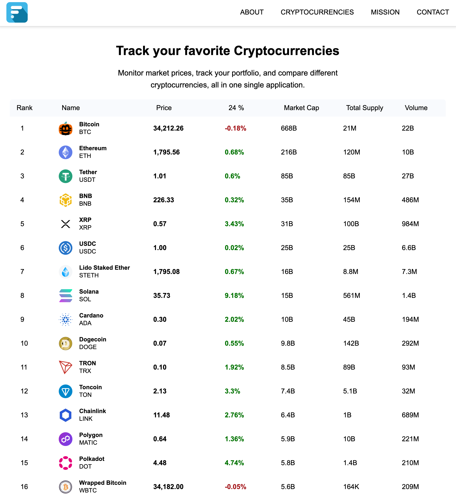

# Fetchcoin

## Technologies Used
* [React.js](https://react.dev/)
* [Tailwind CSS](https://tailwindcss.com/)
* [Coinstats API](https://documenter.getpostman.com/view/5734027/RzZ6Hzr3)

## Deployment
https://mattwhen.github.io/fetchcoin/

## Description 
👋🏼   Welcome to Fetchcoin! A web application that fetches (hence the name and the JavaScript fetch API) cryptocurrency data using the [Coinstats API](https://documenter.getpostman.com/view/5734027/RzZ6Hzr3) and renders the data onto a webpage to the user, it includes information such as the ticker symbol, icon, current price, the percentage change, and the market cap of the coin. What inspired me to create this application is due to my interest in Cryptocurrency and having a strong interest in finance. I also thought it would be a great opportunity for me to futher enhance my knowledge with React and React hooks, Tailwind CSS, and Promises to name a few. <br> <br>

## How it works
As mentioned previously, this application retrieves some data from a server by using an API (Fetch API to be specific) by making a HTTP GET request using the fetch() method that is built into JavaScript. We utilize the useEffect hook from React, to asynchrounously fetch our data while the rest of the content on the page loads. We also display to the user while the data is being fetched with a spinning loading icon to indicate to the user that we expect something to appear here momentarily while our browser fetches our data. Using TailwindCSS, we not only use it for styling our entire webpage, but it is used to create our table that has the appropriate columns and rows to display all the fetched data accordingly. <br> <br>

## Mobile Layout
<br>
<p>

</p> <br><br>

## Desktop Layout
<br>
<p>

</p>  <br><br>

## Contributions
I am always looking for future improvements and suggestions for my projects, you can contribute to this project by going to my [repo](https://github.com/mattwhen/fetchcoin) and creating a pull request. This project is still under development, which means it also needs quite a bit of work 😅. If you need assistance with how to clone the repo, simply follow these three steps. <br>

1.  Clone the repo using the link [here](https://github.com/mattwhen/fetchcoin). 

2. From there, click on the Git Clone button using your preferred method as shown below to clone the application. <br><br>

<p align='center'>

</p>
<br>

3. Once you clone the repo, run the application locally in the terminal using the following command:
```
npm run start
```

You can now view the application locally on your machine
http://localhost:3000

4. Make necessary changes, then submit a pull request. 
<br>

## License
This license is covered under the MIT license. <br>

## Questions
Questions, comments, or concerns? Reach me at matt@mattwhen.com <br>
I'm always looking to connect with other developers! 