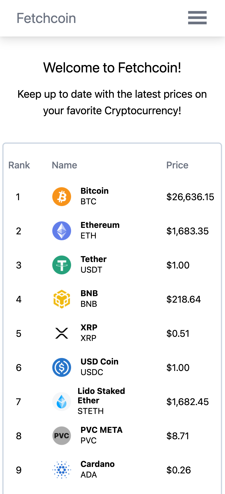
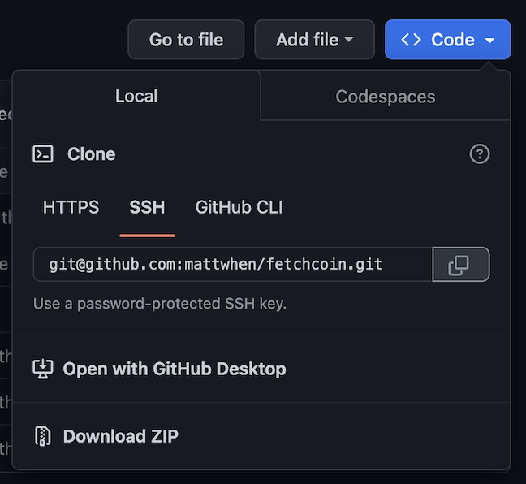

# Fetchcoin

## Technologies Used
* [React.js](https://react.dev/)
* [Tailwind CSS](https://tailwindcss.com/)
* [Coinstats API](https://documenter.getpostman.com/view/5734027/RzZ6Hzr3)

## Description 
👋🏼   Welcome to Fetchcoin! A web application that fetches (hence the name and the JavaScript fetch API) cryptocurrency data using the [Coinstats API](https://documenter.getpostman.com/view/5734027/RzZ6Hzr3) and renders the data onto a webpage to the user, it includes information such as the ticker symbol, icon, current price, the percentage change, and the market cap of the coin. What inspired me to create this application is due to my interest in Cryptocurrency and having a strong interest in finance. I also thought it would be a great opportunity for me to futher enhance my knowledge with React Hooks such as useState and useEffect. Additionally, to learn how Asynchronous JavaScript works behind the scenes. <br> <br>

<p align='center'>

</p>


## Installation 
To run the application locally, you can clone the repo using the link [here](https://github.com/mattwhen/fetchcoin). 

From there, click on the Git Clone button using your preferred method as shown below to clone the application. <br><br>

<p align='center'>

</p>
<br>

## Usage  
Once you clone the repo, run the application locally in the terminal using the following command:
```
npm run start
```

You can now view the application locally on your machine
http://localhost:3000
<br>

## Contributions
I am always looking for future improvements and suggestions for my projects, you can contribute to this project by going to my [repo](https://github.com/mattwhen/fetchcoin) and creating a pull request. This project is still under development, which means it also needs quite a bit of work 😅<br>

## License
This license is covered under the MIT license. <br>

## Questions
Questions, comments, or concerns? Reach me at https://github.com/mattwhen
or email me at: matt@mattwhen.com <br>
I'm always looking to connect with people, and that includes YOU!